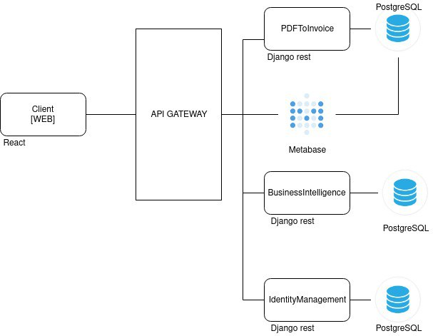

# PDF2K-Nativo
***
# Documento de Arquitetura

***
## Histórico de Revisão
***
| Data | Versão | Descrição | Autor |
|:----:|:------:|:---------:|:-----:|
| 03/09/18 | 0.1 | Abertura do Documento de Arquitetura | Brian Lui |
| 03/09/18 | 0.2 | Metas e Restrições de Arquitetura | Brian Lui |
| 03/09/18 | 0.3 | Representação da Arquitetura | Rafael Teodosio |
| 06/09/18 | 0.4 | Arquitetura de serviços e referenciais | Wictor Girardi |
| 07/09/18 | 0.5 | Introdução | Julio Litwin |
| 07/09/18 | 0.6 | Visão geral | Wictor Girardi |
| 12/09/18 | 0.7 | Diagrama de Casos de Uso| Luís Cláudio T. Lima
|18/09/18 | 0.8 | Revisão da Representação da Arquitetura | Rafael Teodosio
|24/09/18 | 1.0 |Revisão Geral | Rafael Teodosio
***
### 1. Introdução
***

#### 1.1 Finalidade

Este documento apresenta uma visão geral da arquitetura do sistema e utiliza uma série de visões arquiteturais diferentes para ilustrar os diversos aspectos do sistema. Sua intenção é capturar e transmitir as decisões significativas do ponto de vista da arquitetura que foram tomadas em relação ao sistema.

#### 1.2 Escopo

O PDF2CASH é um software projetado para processamento de PDF’s nativos, focado em notas fiscais eletrônicas. Sendo assim, o software irá facilitar e salvando-os em seu banco de dados, podendo assim, ser  utilizado para automatizar na parte de custos/gastos e dentre outros features.

Neste documento, será tratado todas as informações de arquitetura do software, como diagramas de classes, casos de testes, casos de uso e dentre outros.

#### 1.3 Definições, Acrônimos e Abreviações

>MVC(Model View Controller): Arquitetura de software utilizada em sistemas que desejam separar a modelagem de dados, interface e processamento de requisições em camadas independentes.

>Active View: Biblioteca do framework ruby, responsável por implementar o tratamento de requisições da view.

>Active Controller: Biblioteca do framework ruby que implementa toda a camada Controller.

>Active Record: Biblioteca do framework ruby on rails que implementa
operações da camada Model.

>JSON(JavaScript Object Notation): Formato de texto com uma formatação leve de troca de dados.

#### 1.4 Referências
> BORGES, Ateldy; MATIAS, Bruno; Rodrigues, Carlos Enrique; MARQUES, Daniel; COUTINHO, Francisco Wallacy; SANTOS, Yasmin; DADAMOS, Rodrigo. **SIGS**: Documento de Arquitetura. Disponível em:
https://github.com/fga-eps-mds/2017.1-SIGS/wiki/Documento-de-Arquitetura

***

***
### 2. Representação da Arquitetura

A arquitetura utilizada contém dois ambientes diferentes para a nossa aplicação, o ambiente de controle de dados que é conhecido como API e o um ambiente web desenvolvido em ReactJS para os usuários, contemplando um sistema onde usuários podem criar seus projetos, importar dados e adicionar colaboradores.

Com relação a API, o projeto PDF2CA$H será desenvolvido utilizando o framework Django com a API REST.

A API REST é um estilo de arquitetura para fornecer padrões entre sistemas de computador na Web, facilitando a comunicação entre os sistemas. são caracterizados pela forma como são sem estado e separam as preocupações do cliente e do servidor.

* **Serializers** : Os Serializers permitem que dados complexos, como querysets e instâncias de modelo, sejam convertidos em tipos de dados Python nativos que podem ser facilmente renderizados em JSON, ou outros tipos de conteúdo.

* **End Points**: Um Endpoint de um serviço Web é a URL onde seu serviço pode ser acessado por uma aplicação cliente.

A parte visual da aplicação será feita em ReactJS, React é uma biblioteca para criar interfaces.

A arquitetura será representada da seguinte forma:

* **PostgreSQL**: Banco de dados.  

* **PDFToInvoice**: Conversão de PDF nativo para texto.

* **API Gateway**: API Gateway é o único ponto de entrada para todos os clientes manipulando todas as solicitações, fornecendo assim o serviço ideal para cada cliente dependendo da sua necessidade.

* **Identity management**: Identity management é o processo organizational de identificar, autenticar, e autorizar grupos ou usuários que tenham acesso a aplicação associando os direitos e restrições estabelecidos.

* **Metabase**: É uma ferramenta de inteligencia de negocios por onde os dados iram passar para serem feitos os cálculos e graficos.

* **Business Inteligence**: Usar da coleta de dados, organização, análise, ação e monitoramento para tomar melhores decisões e saber se os investimentos feitos estão trazendo bons resultados.
  * **Coleta de dados**: Tudo o que acontece no negócio é analisado para determinar aspectos-chave, como produtividade, gastos, aproveitamento de oportunidades.
  *  **Organização e análise**: Todos os dados captados em cada ação da empresa são organizados em um banco de dados e apresentados de forma visual, para facilitar a análise dos tomadores de decisão.
  * **Ação e monitoramento**: Os responsáveis tomam decisões com base nas informações analisadas, e monitoram seus resultados para ver se estão sendo bem-sucedidos.

***

### 3. Metas e Restrições de Arquitetura

***

 O projeto PDF2CA$H possui as seguintes metas:

* Suporte com os principais navegadores web da atualidade : Google Chrome, Internet Explorer, Microsoft Edge e Mozilla Firefox

Logo abaixo será apresentada as restrições da arquitetura:
* Framework Django 2.0.3 com Python 3.5.2
* Django REST: um framework utilizada para construção de WEB APIs
* Banco de dados relacional PostgreSQL

***
### 4. Visão Geral
***

#### 4.1 Atores

#### 4.2 Administrador

O Administrador pode manter usuários cadastrados, manter empresas cadastradas assim como remover, visualizar e editar notas fiscais.

#### 4.3 Usuário

O Usuário comum pode visualizar a empresa da qual está cadastrado, adicionar notas fiscais ao programa, gerenciar as análises baseadas nas notas fiscais geradas pelo programa assim como visualizar, modificar e deletar as notas fiscais já existentes.

#### 4.4 Diagrama de Casos de Uso         

#### 4.5 Descrição dos Casos de Uso

##### UC01 - (ME) Manter Empresa:
Esse caso de uso permite que o usuário com acesso de administrador no programa possui o poder de criar, manter, modificar ou deletar as empresas adicionadas por ele ao programa.
##### UC02 - Manter User:
Esse caso de uso permite que o administrador possui o poder de criar, deletar, modificar ou manter usuários em suas empresas cadastradas.
###### UC03 - (MA) Manter Analise:
Esse caso de uso permite que o usuário tenha o poder de criar, deletar, modificar ou manter análises baseadas nas notas fiscais existentes.
###### UC04 - (RNF) Remover Nota Fiscal:
Esse caso de uso permite ao usuário e ao administrador remover as notas fiscais já existentes no programa, de maneira completa ou não.
###### UC05 -(VE) Visualizar Empresa:
Esse caso de uso permite que o usuário visualizar a empresa da qual é cadastrado.
###### UC06 - (ANF) Adicionar Nota Fiscal:
Esse caso de uso permite ao usuário fazer a adição de notas fiscais ao programa.
###### UC07 -(ENF) Editar Nota Fiscal:
 Esse caso de uso permite ao usuário fazer a edição de uma nota fiscal.
###### UC08 -(VNF) Visualizar Nota Fiscal:
Esse caso de uso permite ao usuário e ao administrador visualizarem uma nota fiscal.

***
### 5. Arquitetura dos Serviços e Visão de Implementação
***

#### 5.1 Visão Geral

Modelo MVT:

#### 5.1.1. Model
As Models do MVC e do MVT são equivalentes em responsabilidades. O framework Django facilita na interface com o banco de dados. Cada classe da modelo se compara a uma tabela do banco de dados, e as instâncias destas classes, representam os registros destas tabelas. Para adicionar valores ao banco, basta defini-los nas respectivas variáveis. Esta camada contém qualquer coisa e tudo sobre os dados: como acessá-lo , como validá-lo , quais comportamentos que têm e as relações entre os dados. Para o mapeamento dos dados, não será necessário utilizar códigos em SQL para garantir a persistência dos dados no banco.

#### 5.1.2. View
A camada View é responsável pela implementação das regras de apresentação e negócio do nosso sistema. É nela onde iremos nos comunicar com a Model e a Template, cadastrando e tratando as informações recebidas. Retornando para o usuário uma resposta, como HTMLs, XML, ou erros encontrados.

#### 5.1.3. Template
Templates é a camada que retorna a visão para o usuário do programa. Essa camada é composta por, HTML,CSS, javascript e etc. Geralmente linguagens focadas na apresentação do site para o usuário.

#### 5.1.3. Detalhes arquiteturais de projetos Django
As resoluções de urls, responsabilidade dada às controllers no MVC, é feita pela própria estrutura do framework;
O Django oferece uma interface com o banco de dados que permite ao desenvolvedor não se preocupar com a conexão entre suas classes de domínio e banco.

#### 5.2 Micro Serviços e Camadas
A arquitetura de micro serviços é utilizada para desenvolver uma aplicação como um conjunto de pequenos serviços, cada um funcionando em seu próprio processo. Cada serviço é desenvolvido em torno de um conjunto de regras de negócio específico, e é implementado de forma independente.
Com isso, consegue-se quebrar algumas barreiras existentes no modelo de arquitetura monolítica:
#### 5.2.1 Manutenção e evolução dos serviços mais estáveis
Os desenvolvedores tratarão de códigos que executam uma única função, e cada serviço individual não cresce indefinidamente com o crescimento do sistema.
#### 5.2.2 Serviços com baixo nível de acoplamento e interdependência
Dessa forma, a manutenção em um serviço não interfere diretamente em outras funcionalidades do sistema.
#### 5.2.3 Escalabilidade do sistema
É obtida com o deploy e replicação de micro serviços através da infraestrutura de servidores, máquinas virtuais e containers de forma independente. Isso torna o crescimento e a possibilidade de adaptação do sistema muito mais flexível.
#### 5.2.4 Redução de custos
Como cada aplicação só utiliza os serviços de que necessita, os custos são diretamente associados à funcionalidade e à carga de uso do sistema, não sendo necessário carregar custos associados a funcionalidades não utilizadas.
#### 5.2.5 Flexibilidade de tecnologia
Não é necessário amarrar os desenvolvedores a uma tecnologia específica, pois há baixo acoplamento entre os serviços. Dessa forma, pode ser utilizada a melhor tecnologia para atender a cada caso, além da possibilidade de evoluir o sistema continuamente, diminuindo o risco da obsolescência tecnológica.
#### 5.2.6 Facilidade de colocar alterações em produção
As mudanças no sistema são feitas através das alterações e evoluções feitas nos serviços. Assim, não existe um sistema que precisa ser reinicializado para continuar funcionando. O time de desenvolvimento que precisará acompanhar a mudança será o time responsável pelos serviços que estão sendo alterados.

***
### 7. Referências
***
[Business Intelligence]
https://inteligencia.rockcontent.com/business-intelligence/

[What is REST]
https://www.codecademy.com/articles/what-is-rest

[Django REST Framework] http://www.django-rest-framework.org/api-guide/serializers

[Modelo MVT em Django]   
https://github.com/fga-eps-mds/A-Disciplina/wiki/Padr%C3%B5es-Arquiteturais---MVC-X-Arquitetura-do-Django

[Micro Serviços: Qual a diferença para arquitetura monolitica] https://www.opus-software.com.br/micro-servicos-arquietura-monolitica/
