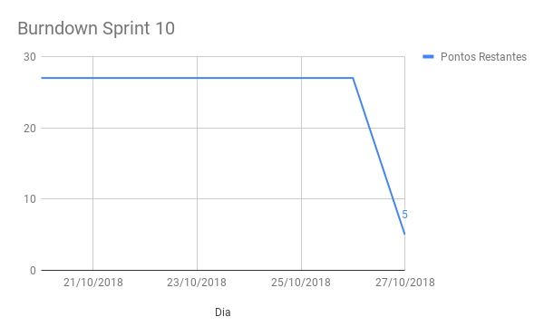
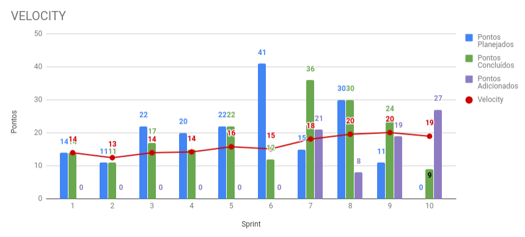
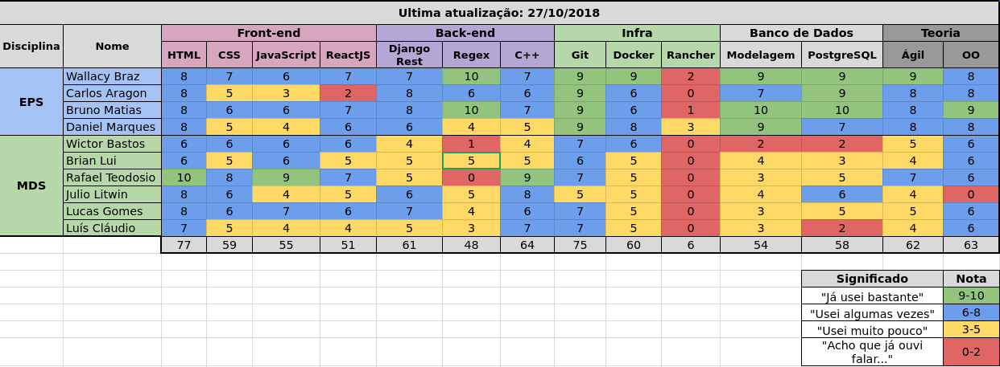

# Sprint 10

## Histórico da Revisão
| Data | Versão | Descrição | Autor |
|:----:|:------:|:---------:|:-----:|
| 22/10/2018 | 0.1 | Planejamento da sprint | Daniel Marques |
| 29/10/2018 | 1.0 | Resultado da sprint | Daniel Marques |

## 1. Introdução

**Número da Sprint**: 10

**Data de Início**: 20/10/2018

**Data de Término**: 27/10/2018

**Duração**: 7 dias

**Pontos Planejados**: 0

**Pontos Adicionados (Dívida)**: 

## 2. Papéis

**Scrum Master:**
* Daniel Marques

**Product Owner:**
* Carlos Aragon

**Arquiteto:**
* Bruno Matias

**DevOps:**
* Francisco Wallacy

**Desenvolvedores:**
* Brian Lui
* Julio Litwin
* Lucas Gomes
* Luís Cláudio
* Rafael Teodósio
* Wictor Girardi

## 3. Histórias Planejadas

## 4. Histórias Adicionadas (Dívida)

### 4.1. [EP03FE07TS06 - Refatorar Menu Lateral](https://github.com/fga-eps-mds/2018.2-PDF2CASH/issues/120) (3 pontos)

#### 4.1.1. Descrição

**Eu, como** desenvolvedor **desejo** refatorar o menu lateral **para** proporcionar uma interface mais acessível.

#### 4.1.2. Critério de Aceitação

* Deve permitir o acesso as funções principais do sistema a partir do menu lateral

#### 4.1.3. Responsáveis

* Rafael Teodosio
* Wictor Girardi

### 4.2. [EP03FE07TS04 - Refatorar tabelas](https://github.com/fga-eps-mds/2018.2-PDF2CASH/issues/121) (3 pontos)

#### 4.2.1. Descrição

**Eu, como** desenvolvedor **desejo** refatorar tabelas (funcionário e de nota fiscal) **para** proporcionar uma interface mais acessível e padronizada.

#### 4.2.2. Critério de Aceitação

* Formularios devem ser apresentados de forma simples e intuitiva

#### 4.2.3. Responsáveis

* Rafael Teodósio
* Wictor Girardi

### 4.3. [EP02FE06TS08 - Mudar conversor de pdf nativo](https://github.com/fga-eps-mds/2018.2-PDF2CASH/issues/126) (13 pontos)

#### 4.3.1. Descrição

**Eu, como** desenvolvedor **desejo** mudar o conversor de pdf **para** poder abranger uma maior quantidade de tipos de notas fiscais eletrônicas.

#### 4.3.2. Critério de Aceitação

* O conversor deve abranger uma maior quantidade de tipos de pdf de notas fiscais.
* O conversor não deve demorar mais que 5 segundos para converter um pdf todo.

#### 4.3.3. Responsáveis

* Lucas Gomes
* Julio Litwin

### 4.4. [EP02FE09TS09 - Gerar novos gráficos a partir do Metabase](https://github.com/fga-eps-mds/2018.2-PDF2CASH/issues/127) (3 pontos)

#### 4.4.1. Descrição

**Eu, como** desenvolvedor **desejo** gerar mais gráficos a partir dos dados das notas fiscais **para** informar o usuário sobre o andamento dos gastos de sua empresa.

#### 4.4.2. Critério de Aceitação

* Deve ser criado uma área só para gráficos no menu lateral do.
* Deve ser adicionado também os gráficos na dashboard.

#### 4.4.3. Responsáveis

* Brian Lui
* Luís Claudio

### 4.5. [EP01FE04TS09 - Implementar API Gateway](https://github.com/fga-eps-mds/2018.2-PDF2CASH/issues/128) (5 pontos)

#### 4.5.1. Descrição

**Eu, como** desenvolvedor **desejo** implementar a autenticação através do API Gateway  **para** criar a camada de segurança entre o micro serviço do front e os micro serviços do back end.

#### 4.5.2. Critério de Aceitação

* Os micro serviços do back end devem permitir apenas o serviço do API Gateway.

#### 4.5.3. Responsáveis

* Daniel Marques
* Bruno Matias

## 5. Presença no Sprint Planning

| Presente | Membro |
|:--------:|:------:|
| S | Brian Lui |
| N | Bruno Matias |
| N | Carlos Aragon |
| S | Daniel Marques |
| S | Francisco Wallacy |
| S | Julio Litwin |
| S | Lucas Gomes |
| S | Luís Cláudio |
| S | Rafael Teodósio |
| S | Wictor Girardi |

## 6. Resultado

| ID | História | Status | Pontos |
|:--:|:--------:|:------:|:------:|
| EP02FE06TS08 | Mudar conversor de pdf nativo | Não Concluído | 13 |
| EP02FE09TS09 | Gerar novos gráficos a partir do Metabase | Concluído | 3 |
| EP01FE04TS09 | Implementar API Gateway | Não Concluído | 5 |
| EP03FE07TS06 | Refatorar Menu Lateral | Concluído | 3 |
| EP03FE07TS04 | Refatorar tabelas | Concluído | 3 |

**Pontos concluídos:** 9

**Pontos de dívidas:** 18

## 6.1. Burndown da Sprint

## 6.2. Velocity

Para visualizar a imagem ampliada, [clique aqui](../../assets/velocity/velocity10.png).

## 6.3. Quadro de Conhecimentos

Para visualizar a imagem ampliada, [clique aqui](../../assets/quadro-de-conhecimento/quadro10.png).

### 6.4. Retrospectiva:

| Negativo | Positivo | Melhoria |
|:--------:|:--------:|:--------:|
| Não há ambiente de homologação | Integrantes tiveram um aumento no conhecimento da tecnologia NextJS | Implementar ambiente de homologação |
| Ocorreu provas na semana | Maior conhecimento com a tecnologia Rancher | Gerar primeira versão de release do produto |
| Houve pouca história crucial concluída na sprint | Maior conhecimento na API Getway que ainda está sendo implementado | Implementar autenticação na aplicação |
| Ainda não há autenticação na aplicação | A parte financeira do software já está estável |  |
| O Metabase não está atendendo muito bem nossas expectativas |  |  |
### 6.5. Retrospectiva do Scrum Master:

A sprint não foi produtiva, sendo que um dos motivos foi ocorrer provas de outras matérias. A história com maior dificuldade não pode ser concluída por ser mais trabalhosa e complexa do que o esperado. Como poucos integrantes tem conhecimento emm C++ e em Qt, está dificultando mais ainda a conclusão da história, mas uma boa parte dela já foi feita.

Foi gerado novos gráficos a partir do Metabase com filtros inclusos, mas o Metabase não está atendendo os nossos quesitos de usabilidade. Um dos problemas encontrados foi estar travando a movimentação do menu lateral da aplicação, provavelmente por causa do iframe.

Um dos integrantes está com menos contato com o projeto, na qual já foi comunicado essa observação para o mesmo.

### 6.6. Presença no Sprint Review

| Presente | Membro |
|:--------:|:------:|
| S | Brian Lui |
| N | Bruno Matias |
| N | Carlos Aragon |
| S | Daniel Marques |
| S | Francisco Wallacy |
| S | Julio Litwin |
| S | Lucas Gomes |
| S | Luís Cláudio |
| S | Rafael Teodósio |
| S | Wictor Girardi |
