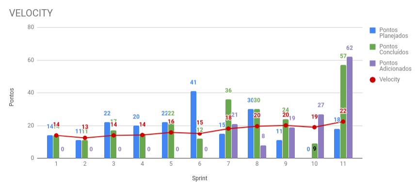

# Sprint 11

## Histórico da Revisão
| Data | Versão | Descrição | Autor |
|:----:|:------:|:---------:|:-----:|
| 22/10/2018 | 0.1 | Planejamento da sprint | Daniel Marques |
| 04/10/2018 | 1.0 | Resultado da sprint | Daniel Marques |

## 1. Introdução

**Número da Sprint**: 11

**Data de Início**: 27/10/2018

**Data de Término**: 04/11/2018

**Duração**: 8 dias

**Pontos Planejados**: 0

**Pontos Adicionados (Dívida)**: 57

## 2. Papéis

**Scrum Master:**
* Daniel Marques

**Product Owner:**
* Carlos Aragon

**Arquiteto:**
* Bruno Matias

**DevOps:**
* Francisco Wallacy

**Desenvolvedores:**
* Brian Lui
* Julio Litwin
* Lucas
* Luís Cláudio
* Rafael Teodósio
* Wictor Girardi

## 3. Histórias Planejadas

As histórias podem ser vistas no [backlog do produto](https://github.com/fga-eps-mds/2018.2-PDF2CASH/blob/master/docs/methodology/backlog.md).

### 4.1. [EP01FE04US13 - Fazer Login](https://github.com/fga-eps-mds/2018.2-PDF2CASH/issues/134) (8 pontos)

#### 4.1.1. Descrição

* Eu, como administrador ou funcionário desejo entrar na minha conta para ter acesso ao sistema.

#### 4.1.2. Critério de Aceitação

* * Deve ser possível entrar na conta.

#### 4.1.3. Responsáveis

* Bruno Matias
* Brian Lui

### 4.2. [EP03FE07TS14 - Refatorar Formularios](https://github.com/fga-eps-mds/2018.2-PDF2CASH/issues/133) (3 pontos)

#### 4.2.1. Descrição

* Eu como desenvolvedor desejo refatorar o layout dos formulários para dar acessibilidade ao usuário às funcionalidades existentes.

#### 4.2.2. Critério de Aceitação

* Deve condizer com as políticas visuais adotadas no programa.

#### 4.2.3. Responsáveis

* Wictor Girardi

### 4.3. [EP02FE13TS13 - Adicionar gráficos nas páginas](https://github.com/fga-eps-mds/2018.2-PDF2CASH/issues/132) (5 pontos)

#### 4.3.1. Descrição

* Eu, como desenvolvedor desejo disponibilizar os gráficos em páginas separadas para detalhar mais os gastos da empresa.

#### 4.3.2. Critério de Aceitação

* Deve haver um gráfico por página

#### 4.3.3. Responsáveis

* Lucas Gomes

### 4.4. [EP01FE01TS12 - Teste de aceitação (criar funcionário)](https://github.com/fga-eps-mds/2018.2-PDF2CASH/issues/131) (5 pontos)

#### 4.4.1. Descrição

* Eu, como desenvolvedor desejo implementar teste de aceitação na funcionalidade de criar funcionário para testar o front end da funcionalidade.

#### 4.4.2. Critério de Aceitação

* O teste de aceitação deve ter no mínimo 2 casos.

#### 4.4.3. Responsáveis

* Rafael Teodosio
* Daniel Marques

### 4.5. [EP01FE08TS11 - Atualizar microserviços para build](https://github.com/fga-eps-mds/2018.2-PDF2CASH/issues/130) (13 pontos)

#### 4.5.1. Descrição

* Alterar implementação de views e urls das aplicações para ser possivel o build com pyinstaller

#### 4.5.2. Critério de Aceitação

* O teste de aceitação deve ter no mínimo 2 casos.

#### 4.5.3. Responsáveis

* Bruno Matias

### 4.6. [EP01FE05US16 - Cadastrar Administrador](https://github.com/fga-eps-mds/2018.2-PDF2CASH/issues/129) (8 pontos)

#### 4.6.1. Descrição

* Eu, como administrador, desejo criar uma conta para mim e ter acesso ao sistema como administrador

#### 4.6.2. Critério de Aceitação

* O teste de aceitação deve ter no mínimo 2 casos.

#### 4.6.3. Responsáveis

* Luis Claudio
* Wictor Girardi

### 4.7. [EP01FE04US14 - Fazer Logout](https://github.com/fga-eps-mds/2018.2-PDF2CASH/issues/134) (2 pontos)

#### 4.7.1. Descrição

* Eu, como administrador ou funcionário desejo sair da minha conta para ter acesso ao sistema.

#### 4.7.2. Critério de Aceitação

* Deve ser possível entrar na conta.

#### 4.7.3. Responsáveis

* Bruno Matias
* Brian Lui

### 4.8. [EP02FE06TS08 - Mudar conversor de pdf nativo](https://github.com/fga-eps-mds/2018.2-PDF2CASH/issues/126) (13 pontos)

#### 4.8.1. Descrição

**Eu, como** desenvolvedor **desejo** mudar o conversor de pdf **para** poder abranger uma maior quantidade de tipos de notas fiscais eletrônicas.

#### 4.8.2. Critério de Aceitação

* O conversor deve abranger uma maior quantidade de tipos de pdf de notas fiscais.
* O conversor não deve demorar mais que 5 segundos para converter um pdf todo.

#### 4.8.3. Responsáveis

* Lucas Gomes
* Julio Litwin

### 4.9. [EP01FE04TS09 - Implementar API Gateway](https://github.com/fga-eps-mds/2018.2-PDF2CASH/issues/128) (5 pontos)

#### 4.9.1. Descrição

**Eu, como** desenvolvedor **desejo** implementar a autenticação através do API Gateway  **para** criar a camada de segurança entre o micro serviço do front e os micro serviços do back end.

#### 4.9.2. Critério de Aceitação

* Os micro serviços do back end devem permitir apenas o serviço do API Gateway.

#### 4.9.3. Responsáveis

* Daniel Marques
* Bruno Matias

## 4. Presença no Sprint Planning

| Presente | Membro |
|:--------:|:------:|
| S | Brian Lui |
| S | Bruno Matias |
| N | Carlos Aragon |
| S | Daniel Marques |
| S | Francisco Wallacy |
| S | Julio Litwin |
| S | Lucas Gomes |
| S | Luís Cláudio |
| S | Rafael Teodósio |
| S | Wictor Girardi |

## 5. Resultado

| ID | História | Status | Pontos |
|:--:|:--------:|:------:|:------:|
| EP01FE04US13 | Fazer Login | Concluído | 8 |
| EP01FE04US14 | Fazer Logout | Concluído | 2 |
| EP03FE07TS14 | Refatorar Formularios | Concluído | 3 |
| EP02FE13TS13 | Adicionar gráficos nas páginas | Concluído | 5 |
| EP01FE01TS12 | Teste de aceitação (criar funcionário) | Não Concluído | 5 |
| EP01FE08TS11 | Atualizar microserviços para build | Concluído | 13 |
| EP01FE05US16 | Cadastrar Administrador | Concluído | 8 |
| EP02FE06TS08 | Mudar conversor de pdf nativo | Concluído | 13 |
| EP01FE04TS09 | Implementar API Gateway | Concluído | 5 |

**Pontos concluídos:** 57

**Pontos de dívidas:** 5

## 5.1. Burndown da Sprint

## 5.2. Velocity

Para visualizar a imagem ampliada, [clique aqui](../../assets/velocity/velocity11.png).

## 5.3. Quadro de Conhecimentos

Para visualizar a imagem ampliada, [clique aqui](../../assets/quadro-de-conhecimento/quadro11.png).

### 5.4. Retrospectiva:

| Negativo | Positivo | Melhoria |
|:--------:|:--------:|:--------:|
| Complexidade com a tecnologia nightmare para realizar o teste de aceitação | Foi feito a autenticação do back-end e do front-end |  |
| Falta de comunicação entre os integrantes | Está terminando as US's do projeto |  |
| Dificuldades com a renderização dos gráficos do Metabase nas páginas do front-end | Foi concluído a realização do build com pyinstaller | |
|  | Foi concluído o deploy em homologação com Rancher na Digital Ocean |  |
### 5.5. Retrospectiva do Scrum Master:

A sprint teve muitos histórias, a grande maioria foi concluída, até a história de mudança do parser ([EP02FE06TS08 - Mudar conversor de pdf nativo](https://github.com/fga-eps-mds/2018.2-PDF2CASH/issues/126)), que era a mais critíca da sprint alem de vir como dívida da sprint anterior (sprint 10). Além disso, foi finalizado o deploy em homologação na Digital Ocean, usando o Rancher para orquestrar os containers.

Uma grande dificuldade que ocorreu na sprint foi implementar o teste de aceitação. Um dos motivos foi que nenhum integrante tinha experiência com teste de aceitação em NextJS, mesmo pesquisando sobre as tecnologias não foi possível rodar os testes usando a tecnologia Mocha com Nightmare, dando problema com timeout.

O integrante que estava responsável por planejar o teste de usabilidade não o fez ainda, sendo que está atrasando a conclusão do projeto. além de não estar muito presente no projeto.

### 5.6. Presença no Sprint Review

| Presente | Membro |
|:--------:|:------:|
| S | Brian Lui |
| S | Bruno Matias |
| N | Carlos Aragon |
| S | Daniel Marques |
| S | Francisco Wallacy |
| S | Julio Litwin |
| S | Lucas Gomes |
| S | Luís Cláudio |
| S | Rafael Teodósio |
| S | Wictor Girardi |
