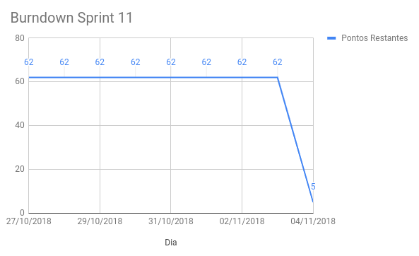

# Sprint 12

## Histórico da Revisão
| Data | Versão | Descrição | Autor |
|:----:|:------:|:---------:|:-----:|
| 05/11/2018 | 0.1 | Planejamento da sprint | Daniel Marques |
| 18/11/2018 | 1.0 | Resultado da sprint | Daniel Marques |

## 1. Introdução

**Número da Sprint**: 12

**Data de Início**: 04/11/2018

**Data de Término**: 14/11/2018

**Duração**: 10 dias

**Pontos Adicionados (Dívida)**: 62

## 2. Papéis

**Scrum Master:**
* Daniel Marques

**Product Owner:**
* Carlos Aragon

**Arquiteto:**
* Bruno Matias

**DevOps:**
* Lucas Gomes

**Desenvolvedores:**
* Brian Lui
* Francisco Wallacy
* Julio Litwin
* Luís Cláudio
* Rafael Teodósio
* Wictor Girardi

## 3. Histórias Adicionadas (Dívida)

As histórias podem ser vistas no [backlog do produto](https://github.com/fga-eps-mds/2018.2-PDF2CASH/blob/master/docs/methodology/backlog.md).

### 3.1. [EP01FE05TS15 - Teste de aceitação (cadastrar administrador)](https://github.com/fga-eps-mds/2018.2-PDF2CASH/issues/) (5 pontos)

#### 3.1.1. Descrição

**Eu, como** desenvolvedor **desejo** implementar teste de aceitação na funcionalidade de cadastrar administrador **para** testar o front end da funcionalidade.

#### 3.1.2. Critério de Aceitação

* O teste de aceitação deve ter no mínimo 2 casos.

#### 3.1.3. Responsáveis

* Rafael Teodosio
* Brian Lui

### 3.2. [EP01FE04TS16 - Teste de aceitação (login e logout)](https://github.com/fga-eps-mds/2018.2-PDF2CASH/issues/) (5 pontos)

#### 3.2.1. Descrição

**Eu, como** desenvolvedor **desejo** implementar teste de aceitação na funcionalidade de login e logout **para** testar o front end da funcionalidade.

#### 3.2.2. Critério de Aceitação

* O teste de aceitação deve ter no mínimo 2 casos.

#### 3.2.3. Responsáveis

* Rafael Teodosio
* Brian Lui

### 3.3. [EP01FE01TS17 - Teste de aceitação (listar funcionário e excluir funcionário)](https://github.com/fga-eps-mds/2018.2-PDF2CASH/issues/) (5 pontos)

#### 3.3.1. Descrição

**Eu, como** desenvolvedor **desejo** implementar teste de aceitação na funcionalidade de listar funcionário **para** testar o front end da funcionalidade.

#### 3.3.2. Critério de Aceitação

* O teste de aceitação deve ter no mínimo 2 casos.

#### 3.3.3. Responsáveis

* Julio Litwin
* Wictor Girardi

### 3.4. [EP01FE01TS19 - Teste de aceitação (editar funcionário)](https://github.com/fga-eps-mds/2018.2-PDF2CASH/issues/) (5 pontos)

#### 3.4.1. Descrição

**Eu, como** desenvolvedor **desejo** implementar teste de aceitação na funcionalidade de editar funcionário **para** testar o front end da funcionalidade.

#### 3.4.2. Critério de Aceitação

* O teste de aceitação deve ter no mínimo 2 casos.

#### 3.4.3. Responsáveis

* Julio Litwin
* Wictor Girardi

### 3.5. [EP02FE02TS20 - Teste de aceitação (listar notas fiscais e excluir nota fiscal)](https://github.com/fga-eps-mds/2018.2-PDF2CASH/issues/) (5 pontos)

#### 3.5.1. Descrição

**Eu, como** desenvolvedor **desejo** implementar teste de aceitação na funcionalidade de listar notas fiscais **para** testar o front end da funcionalidade.

#### 3.5.2. Critério de Aceitação

* O teste de aceitação deve ter no mínimo 2 casos.

#### 3.5.3. Responsáveis

* Lucas Gomes
* Luis Claudio

### 3.6. [EP02FE02TS21 - Teste de aceitação (criar nota fiscal)](https://github.com/fga-eps-mds/2018.2-PDF2CASH/issues/) (3 pontos)

#### 3.6.1. Descrição

**Eu, como** desenvolvedor **desejo** implementar teste de aceitação na funcionalidade de criar nota fiscal **para** testar o front end da funcionalidade.

#### 3.6.2. Critério de Aceitação

* O teste de aceitação deve ter no mínimo 2 casos.

#### 3.6.3. Responsáveis

* Lucas Gomes
* Luis Claudio

### 3.7. [EP01FE01TS23 - Popular banco de dados com funcionários e administrador)](https://github.com/fga-eps-mds/2018.2-PDF2CASH/issues/) (3 pontos)

#### 3.7.1. Descrição

**Eu, como** desenvolvedor **desejo** implementar teste de aceitação na funcionalidade de excluir nota fiscal **para** testar o front end da funcionalidade.

#### 3.7.2. Critério de Aceitação

* O teste de aceitação deve ter no mínimo 2 casos.

#### 3.7.3. Responsáveis

* Rafael Teodósio
* Brian Lui

### 3.8. [EP02FE02TS24 - Popular banco de dados com notas fiscais)](https://github.com/fga-eps-mds/2018.2-PDF2CASH/issues/) (8 pontos)

#### 3.8.1. Descrição

**Eu, como** desenvolvedor **desejo** popular o banco de dados com registros de notas fiscais **para** disponibilizar dados para visualização da aplicação e para teste.

#### 3.8.2. Critério de Aceitação

* Deve haver registros de notas fiscais em semanas diferentes.
* Deve haver registros de notas fiscais em meses diferentes.
* Deve haver registros de notas fiscais em anos diferentes.

#### 3.8.3. Responsáveis

* Rafael Teodósio
* Brian Lui
* Lucas Gomes
* Luis Claudio

### 3.9. [EP02FE02TS25 - Refatorar código do front com ESlint)](https://github.com/fga-eps-mds/2018.2-PDF2CASH/issues/) (5 pontos)

#### 3.9.1. Descrição

**Eu, como** desenvolvedor **desejo** refatorar código do front com ESlint **para** adequar o código a nova folha de estilo do projeto.

#### 3.9.2. Critério de Aceitação

* A nova folha de estilo deve ser adequada aos padrões da folha de estilo do próprio javascript.

#### 3.9.3. Responsáveis

* Lucas Gomes
* Luis Claudio

### 3.10. [EP02FE06TS25 - Integrar Parser (Qt) com o PdfToInvoice (django rest)](https://github.com/fga-eps-mds/2018.2-PDF2CASH/issues/) (13 pontos)

#### 3.10.1. Descrição

**Eu, como** desenvolvedor **desejo** conectar o parser em qt com o back end em django rest **para** o parser poder enviar os dados da nota fiscal lida para o banco de dados.

#### 3.10.2. Critério de Aceitação

* O parser deve enviar em JSON os dados para o django rest.
* O JSON deve ter apenas uma camada (sem objetos dentro de um objeto).

#### 3.10.3. Responsáveis

* Julio Litwin
* Francisco Wallacy

### 3.11. [EP01FE01TS12 - Teste de aceitação (criar funcionário)](https://github.com/fga-eps-mds/2018.2-PDF2CASH/issues/131) ( pontos)

#### 3.11.1. Descrição

* Eu, como desenvolvedor desejo implementar teste de aceitação na funcionalidade de criar funcionário para testar o front end da funcionalidade.

#### 3.11.2. Critério de Aceitação

* O teste de aceitação deve ter no mínimo 2 casos.

#### 3.11.3. Responsáveis

* Rafael Teodosio
* Daniel Marques

## 4. Presença no Sprint Planning

| Presente | Membro |
|:--------:|:------:|
| S | Brian Lui |
| S | Bruno Matias |
| N | Carlos Aragon |
| S | Daniel Marques |
| N | Francisco Wallacy |
| S | Julio Litwin |
| S | Lucas Gomes |
| S | Luís Cláudio |
| S | Rafael Teodósio |
| S | Wictor Girardi |

## 5. Resultado

| ID | História | Status | Pontos |
|:--:|:--------:|:------:|:------:|
| EP01FE01TS12 | Teste de aceitação (criar funcionário) | Concluído | 5 |
| EP01FE01TS15 | Teste de aceitação (cadastrar administrador) | Concluído | 5 |
| EP01FE04TS16 | Teste de aceitação (login e logout) | Concluído | 5 |
| EP01FE01TS17 | Teste de aceitação (listar funcionário e excluir funcionário) | Não Concluído | 5 |
| EP01FE01TS19 | Teste de aceitação (editar funcionário) | Não Concluído | 5 |
| EP02FE02TS20 | Teste de aceitação (listar notas fiscais e excluir nota fiscal) | Concluído | 5 |
| EP02FE02TS21 | Teste de aceitação (criar nota fiscal) | Não Concluído | 3 |
| EP01FE01TS23 | Popular banco de dados com funcionários e administrador) | Não Concluído | 3 |
| EP02FE02TS24 | Popular banco de dados com notas fiscais | Concluído | 8 |
| EP02FE02TS25 | Refatorar código do front com ESlint | Concluído | 5 |
| EP02FE06TS25 | Integrar Parser (Qt) com o PdfToInvoice (django rest) | Concluído | 13 |

**Pontos concluídos:** 56

**Pontos de dívidas:** 6

## 5.1. Burndown da Sprint

## 5.2. Velocity

Para visualizar a imagem ampliada, [clique aqui](../../assets/velocity/velocity12.png).

## 5.3. Quadro de Conhecimentos

Para visualizar a imagem ampliada, [clique aqui](../../assets/quadro-de-conhecimento/quadro12.png).

### 5.4. Retrospectiva:

| Negativo | Positivo | Melhoria |
|:--------:|:--------:|:--------:|
| Muita complexidade das tecnologias para implementar os testes de aceitação | Foi concluído a configuração das tecnologias para realização dos testes de aceitação | Diminuir o nível de dependência do time de desenvolvimento  para o time de gestão |
| Só um par que estava responsável por fazer teste de aceitação entregou cedo a história | A história mais importante da sprint foi concluída | Terminar sprint sem dívidas de histórias |
| Teve atividades de outras matérias (prova e trabalhos) na sprint | O novo conversor/parser em C++ está muito mais rápido | Conseguir buildar a aplicação inteira |
| Adiamento do fechamento da sprint maior que o esperado | Foi configurado o ESlint no front e já foi feito a correção do código |  |
| A sprint repetiu o erro de ter dívidas de histórias |  |  |

### 5.5. Retrospectiva do Scrum Master:

A sprint teve muitas histórias, na verdade, foi a sprint com mais pontuação de histórias para serem implementadas no projeto inteiro no momento. A história mais complexa da sprint e uma das mais críticas (EP02FE06TS25 - Integrar Parser (Qt) com o PdfToInvoice (django rest)) para o projeto foi concluída, sendo que, agora a funcionalidade de criar nota fiscal está respondendo ao novo conversor/parser feito C++ que é mais otimizado do que ao anterior feito com biblioteca em python. O back-end em Django Rest recebe o PDF enviado pelo front-end e passa como parâmetro para o executável do conversor/parser, após isso, é gerado o JSON e guardado no banco de dados. Uma única observação é que o integrante que estava implementando a história estava referenciando a issue errada ([EP02FE06TS07 - Refatorar parser (valor de imposto)](https://github.com/fga-eps-mds/2018.2-PDF2CASH/issues/110)).

Houve também muita complicação com os testes de aceitação, por causa das tecnologias que tinham que ser usadas, tanto para implementar quanto para inicializar, mas após várias tentativas foi possível realizar os testes de aceitação com Jest e Puppeteer.

O integrante responsável por fazer o teste de usabilidade no sistema até agora não realizou nem o planejamento do teste, sendo que ele estava com essa tarefa desde a sprint passada (sprint 11), e somente com essa tarefa, mais nenhuma outra. Ele já foi comunicado várias vezes para realizar essa atividade e mesmo assim não o realizou. Além de não estar muito presente no projeto, como não realizar as atividades de PO, como priorizar quais histórias devem estar na sprint e escrever os critérios de aceitação. O scrum master que está fazendo essas tarefas.

### 5.6. Presença no Sprint Review

| Presente | Membro |
|:--------:|:------:|
| S | Brian Lui |
| S | Bruno Matias |
| N | Carlos Aragon |
| S | Daniel Marques |
| S | Francisco Wallacy |
| S | Julio Litwin |
| S | Lucas Gomes |
| S | Luís Cláudio |
| S | Rafael Teodósio |
| S | Wictor Girardi |
