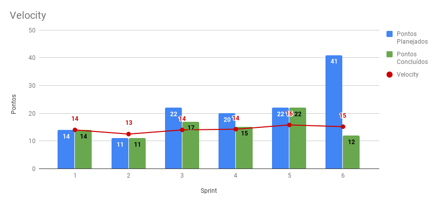

# Sprint 06

## Histórico da Revisão
| Data | Versão | Descrição | Autor |
|:----:|:------:|:---------:|:-----:|
| 22/09/2018 | 1.0 | Planejamento e retrospectiva da sprint | Carlos Aragon |
| 08/10/2018 | 1.1 | Revisão | Daniel Marques |

## 1. Introdução

**Número da Sprint**: 6

**Data de Início**: 22/09/2018

**Data de Término**: 02/10/2018

**Duração**: 10 dias

**Pontos Planejados**: 41

**Pontos Adicionados (Dívida)**: 0

## 2. Papéis

**Scrum Master:**
* Carlos Aragon

**Product Owner:**
* Daniel Marques

**Arquiteto:**
* Bruno Matias

**DevOps:**
* Francisco Wallacy

**Desenvolvedores:**
* Brian Lui
* Julio Litwin
* Lucas
* Luís Cláudio
* Rafael Teodósio
* Wictor Girardi

## 3. Histórias Planejadas

As histórias podem ser vistas no [backlog do produto](https://github.com/fga-eps-mds/2018.2-PDF2CASH/blob/master/docs/methodology/backlog.md).

### 3.1. EP02FE02US07 - [Criar nota fiscal](https://github.com/fga-eps-mds/2018.2-PDF2CASH/issues/76) (8 pontos)

#### 3.1.1. Descrição

**Eu, como** administrador ou funcionário **desejo** ler e armazenar os dados da nota fiscal a partir de pdf's nativos **para** poder gerenciar os gastos da empresa, assim, planejar as estratégias futuras.

#### 3.1.2. Critério de Aceitação

* O usuário deve poder adicionar o arquivo PDF a ser criado a NF.
* A nota fiscal a ser adicionada deve ser nativa (conter texto).
* O sistema deve notificar o usuário sobre conclusão ou falha no processo.

### 3.2. EP02FE02US09	- [Visualizar nota fiscal](https://github.com/fga-eps-mds/2018.2-PDF2CASH/issues/77) (5 pontos)

#### 3.2.1. Descrição

**Eu, como** administrador ou funcionário	 **desejo**	visualizar dados de uma nota fiscal específica **para**	ter conhecimento dos gastos registrados em uma nota fiscal.

#### 3.2.2. Critério de Aceitação

* O usuário deve poder visualizar os seguintes dados de uma NF específica:
  * Dados da NF:
    * Natureza da Operação
    * Chave de acesso
    * Protocolo de Autorização de Uso
    * Data de Emissão
  * Dados do Emitente:
    * Nome
    * Cnpj
    * Inscrição Estadual
  * Dados do Remetente:
    * Nome
    * Cnpj
    * Endereço
    * Município
    * Bairro
    * Telefone
    * Cep
  * Imposto:
    * Valor de ICMS
    * Valor do seguro
    * Valor do frete
    * Valor da Confins
    * Valor da importação
    * Valor do PIS
    * Outras despesas
  * Transportador:
    * Nome
    * Frente por conta
    * Código ANTT
    * Placa do veículo
    * Cnpj
    * Endereço
    * Município
    * Inscrição Estadual
    * Quantidade
    * Espécie
    * Marca
    * Número
    * Peso Bruto
    * Peso Líquido
  * Produto/Serviço:
    * Item
    * Código de cada item
    * Valor unitário
    * Valor total
    * Quantidade

### 3.3. EP02FE02US10	- [Listar nota fiscal](https://github.com/fga-eps-mds/2018.2-PDF2CASH/issues/78) (3 pontos)

#### 3.3.1. Descrição

**Eu, como** administrador ou funcionário **desejo**	listar notas fiscais registradas no sistema **para**	ter conhecimento das notas fiscais registradas no sistema.

#### 3.3.2. Critério de Aceitação

* O usuário deve poder visualizar todas as notas fiscais armazenadas no sistema.
* A listagem de NF deve ser feita por um modo de tabela.
* Em cada linha da tabela deve haver:
  * Nome da empresa emitente
  * CNPJ da empresa emitente
  * Chave de acesso
  * Data de Emissão
  * Valor total

### 3.4. EP02FE06TS01	- [Converter PDF](https://github.com/fga-eps-mds/2018.2-PDF2CASH/issues/74) (1 pontos)

#### 3.4.1. Descrição

**Eu, como** Desenvolvedor **desejo**	converter o pdf de nota fiscal em texto **para**	o parser realizar a análise.

#### 3.4.2. Critério de Aceitação

* O PDF que será convertido deve ser nativo (conter texto).
* Deve ser gerado um arquivo de texto na saída da conversão.
* O texto gerado deve ser armazenado no banco de dados.
* Deve ser usado uma ferramenta que já faça a conversão.

### 3.5. EP02FE06TS02	- [Parser de nota fiscal](https://github.com/fga-eps-mds/2018.2-PDF2CASH/issues/75) (21 pontos)

#### 3.5.1. Descrição

**Eu, como** desenvolvedor **desejo** realizar a análise de cada nota fiscal **para** poder criar uma estrutura de dados de notas fiscais.

#### 3.5.2. Critério de Aceitação

* O PDF que será convertido deve ser nativo (conter texto).
* Deve ser gerado um arquivo de texto na saída da conversão.
* O texto gerado deve ser armazenado no banco de dados.
* Deve ser usado uma ferramenta que já faça a conversão.

### 3.5. EP03FE07TS03	- [Menu Lateral]() (3 pontos)

#### 3.5.1. Descrição

**Eu, como** desenvolvedor **desejo** implementar layout básico do sistema **para** dar acessibilidade ao usuário as funcionalidades existentes.

#### 3.5.2. Critério de Aceitação

* O PDF que será convertido deve ser nativo (conter texto).
* Deve ser gerado um arquivo de texto na saída da conversão.
* O texto gerado deve ser armazenado no banco de dados.
* Deve ser usado uma ferramenta que já faça a conversão.

## 4. Presença no Sprint Planning

| Presente | Membro |
|:--------:|:------:|
| S | Brian Lui |
| S | Bruno Matias |
| S | Carlos Aragon |
| S | Daniel Marques |
| S | Francisco Wallacy |
| S | Julio Litwin |
| S | Lucas Gomes |
| S | Luís Cláudio |
| S | Rafael Teodósio |
| S | Wictor Girardi |

## 5. Resultados

| ID | História | Status | Pontos |
|:--:|:--------:|:------:|:------:|
| EP02FE02US07 | Criar nota fiscal | Não concluído | 8 |
| EP02FE02US09 | Visualizar nota fiscal | Concluído | 5 |
| EP02FE02US10 | Listar nota fiscal | Concluído | 3 |
| EP02FE06TS01 | Converter PDF | Concluído | 1 |
| EP02FE06TS02 | Parser de nota fiscal | Não concluído | 21 |
| EP03FE07TS03 | Menu Lateral | Concluído | 3 |

**Pontos concluídos:** 12

**Pontos não concluídos:** 29

## 5.1. Burndown da Sprint

## 5.2. Velocity da Sprint

Para visualizar a imagem ampliada, [clique aqui](../../assets/velocity/velocity06.png).

## 5.3. Quadro de Conhecimentos

Para visualizar a imagem ampliada, [clique aqui](../../assets/quadro-de-conhecimento/quadro06.png).

### 5.4. Retrospectiva:

| Negativo | Positivo | Melhoria |
|:--------:|:--------:|:--------:|
| Alguns integrantes não fizeram as atividades planejadas. | Integrantes aumentaram o conhecimento nas tecnologias | EPS deve aumentar a cobrança sobre os integrantes de MDS |
| A equipe está desorganizada | Alguns integrantes conseguiram entregar suas histórias  | Aprender mais as tecnologias |
| Alguns integrantes não implementaram muito em ReactJS | Aumento de conhecimento em teste em python | Os integrantes da equipe devem ser mais proativos |
| Falta de disciplina na equipe | A comunicação da equipe foi mais efetiva comparada as sprints passadas | Ter mais responsabilidade com o projeto |
| A equipe está sem dedicação ao projeto | A equipe implementou mais em relação as sprints passadas | Aumentar a regularidade de trabalho |
| Falta de foco da equipe | Aumento de conhecimento com o pareamento na tecnologia ReactJS |  |
| Alguns integrantes não estão dedicando tempo ao projeto | Mais engajamento de alguns integrantes |  |
| Alguns integrantes não estão trabalhando com o desempenho esperado |  |  |
| A equipe não está rendendo como deveria |  |  |
| Alguns integrantes não estão proativos |  |  |
| Falta de compromentimento |  |  |
| A equipe está muito atrasada |  |  |

### 5.5. Retrospectiva do Scrum Master:

Sprint com alta produtividade, devido a necessidade de entregar valor para a release 1. Mas não foi concluído duas histórias planejadas que eram para ser entrega na Release 01.

### 5.6. Presença no Sprint Review

| Presente | Membro |
|:--------:|:------:|
| S | Brian Lui |
| S | Bruno Matias |
| S | Carlos Aragon |
| S | Daniel Marques |
| S | Francisco Wallacy |
| S | Julio Litwin |
| S | Lucas Gomes |
| S | Luís Cláudio |
| S | Rafael Teodósio |
| S | Wictor Girardi |
