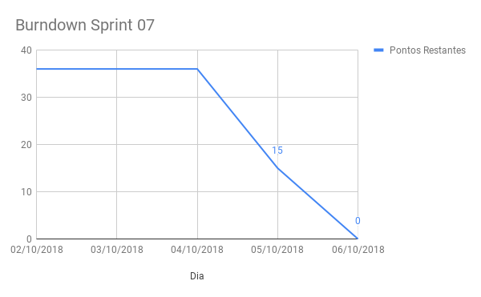

# Sprint 07

## Histórico da Revisão
| Data | Versão | Descrição | Autor |
|:----:|:------:|:---------:|:-----:|
| 02/10/2018 | 1.0 | Planejamento da sprint | Daniel Marques |
| 08/10/2018 | 1.1 | Retrospectivas da sprint | Daniel Marques |

## 1. Introdução

**Número da Sprint**: 7

**Data de Início**: 02/10/2018

**Data de Término**: 06/10/2018

**Duração**: 4 dias

**Pontos Planejados**: 15

**Pontos Adicionados (Dívida)**: 21

## 2. Papéis

**Scrum Master:**
* Daniel Marques

**Product Owner:**
* Carlos Aragon

**Arquiteto:**
* Bruno Matias

**DevOps:**
* Francisco Wallacy

**Desenvolvedores:**
* Brian Lui
* Julio Litwin
* Lucas
* Luís Cláudio
* Rafael Teodósio
* Wictor Girardi

## 3. Histórias Planejadas

As histórias podem ser vistas no [backlog do produto](https://github.com/fga-eps-mds/2018.2-PDF2CASH/blob/master/docs/methodology/backlog.md).

### 3.1. EP01FE01US01 - [Criar Funcionário](https://github.com/fga-eps-mds/2018.2-PDF2CASH/issues/96) (5 pontos)

#### 3.1.1. Descrição

**Eu, como** administrador **desejo**	criar a conta de um funcionário	**para** o funcionário ter acesso aos dados financeiros da empresa dentro do sistema.

#### 3.1.2. Critério de Aceitação

* Um novo funcionário deve ser criado.

#### 3.1.3. Responsáveis

* Luís Claudio
* Wictor Girardi

### 3.2. EP01FE01US03 - [Deletar Funcionário](https://github.com/fga-eps-mds/2018.2-PDF2CASH/issues/94) (2 pontos)

#### 3.2.1. Descrição

**Eu, como** administrador **desejo**	deletar a conta de um funcionário **para** apagar conta não utilizada mais.

#### 3.2.2. Critério de Aceitação

* O funcionário deve ser deletado
* Deve existir uma mensagem de confirmação
* Um funcionário não pode excluir a propria conta

#### 3.2.3. Responsáveis

* Luís Claudio
* Wictor Girardi

### 3.3. EP01FE01US04 - [Visualizar Funcionário](https://github.com/fga-eps-mds/2018.2-PDF2CASH/issues/97) (5 pontos)

#### 3.3.1. Descrição

**Eu, como** administrador **desejo**	visualizar a conta de um funcionário	**para** ter conhecimento dos dados do funcionário e a empresa relacionada a ele.

#### 3.3.2. Critério de Aceitação

* Todas as informações do funcionario devem estar disponiveis

#### 3.3.3. Responsáveis

* Brian Lui
* Julio Litwin

### 3.4. EP01FE01US05 - [Listar Funcionários](https://github.com/fga-eps-mds/2018.2-PDF2CASH/issues/95) (3 pontos)

#### 3.4.1. Descrição

**Eu, como** administrador **desejo**	visualizar a lista de contas de funcionários	**para** ter conhecimento dos funcionários registrados.

#### 3.4.2. Critério de Aceitação

* Devem ser listados os funcionários correspondentes a empresa
* Devem haver botões para ver e deletar um funcionário

#### 3.4.3. Responsáveis

* Lucas Gomes
* Rafael Teodósio

## 4. Histórias Adicionadas (Dívida)

### 4.1. EP02FE06TS02	- [Parser de nota fiscal](https://github.com/fga-eps-mds/2018.2-PDF2CASH/issues/75) (21 pontos)

#### 4.1.1. Descrição

**Eu, como** desenvolvedor **desejo** realizar a análise de cada nota fiscal **para** poder criar uma estrutura de dados de notas fiscais.

#### 4.1.2. Critério de Aceitação

* O PDF que será convertido deve ser nativo (conter texto).
* Deve ser gerado um arquivo de texto na saída da conversão.
* O texto gerado deve ser armazenado no banco de dados.
* Deve ser usado uma ferramenta que já faça a conversão.

#### 4.1.3. Responsáveis

* Bruno Matias
* Carlos Aragon

## 5. Presença no Sprint Planning

| Presente | Membro |
|:--------:|:------:|
| S | Brian Lui |
| S | Bruno Matias |
| S | Carlos Aragon |
| S | Daniel Marques |
| S | Francisco Wallacy |
| S | Julio Litwin |
| S | Lucas Gomes |
| S | Luís Cláudio |
| S | Rafael Teodósio |
| S | Wictor Girardi |

## 6. Resultado

| ID | História | Status | Pontos |
|:--:|:--------:|:------:|:------:|
| EP01FE01US01 | Criar Funcionário | Concluído | 5 |
| EP01FE01US03 | Deletar Funcionário | Concluído | 2 |
| EP01FE01US04 | Visualizar Funcionário | Concluído | 5 |
| EP01FE01US05 | Listar Funcionários | Concluído | 3 |
| EP02FE06TS02 | Parser de nota fiscal | Concluído | 21 |

**Pontos concluídos:** 36

**Pontos não concluídos:** 0

## 6.1. Burndown da Sprint

## 6.2. Velocity da Sprint

Para visualizar a imagem ampliada, [clique aqui](../../assets/velocity/velocity07.png).

## 6.3. Quadro de Conhecimentos

Para visualizar a imagem ampliada, [clique aqui](../../assets/quadro-de-conhecimento/quadro07.png).

### 6.4. Retrospectiva:

| Negativo | Positivo | Melhoria |
|:--------:|:--------:|:--------:|
| Termino encima da hora | Houve mais desenvolvimento das histórias | Aumentar produtividade |
| Pontualidade no Sprint Review | Maior participação | Ter pontualiadade na sprint review |
| Prazo menor da sprint | Maior organização | Maior organização do sprint planning  |
| Configuração dos repositórios | A equipe conseguiu entregar todas as histórias |  |
| As branchs não foram deletadas após merge do PR | Maior participação dos integrantes na implementação |  |
| Integrantes está deixando de commitar no final da sprint | Integrante trabalharam mais na tecnologia ReactJS |  |
|  | Maior comprometimento |  |
|  | Maior eficiência |  |

### 6.5. Retrospectiva do Scrum Master:

Nessa sprint foi visto muito mais produtividade do que nas anteriores, que pode ser vistos na conclusão de todas as histórias planejadas para a sprint. A equipe de desenvolvimento foi mais produtiva e proativa ao fazer as histórias, que pode ser visto no quadro de conhecimento o aumento de conhecimento nas tecnologias. A impressão é que a equipe foi bem engajada nessa sprint e mais comunicativa.

Um dos pontos negativos foi os integrantes não atualizarem o kanban constantemente, deixando-o desatualizado, e alguns integrantes não conseguiram ser pontuais na Sprint Review da mesma.  

### 6.6. Presença no Sprint Review

| Presente | Membro |
|:--------:|:------:|
| S | Brian Lui |
| S | Bruno Matias |
| S | Carlos Aragon |
| S | Daniel Marques |
| S | Francisco Wallacy |
| S | Julio Litwin |
| S | Lucas Gomes |
| S | Luís Cláudio |
| S | Rafael Teodósio |
| S | Wictor Girardi |
